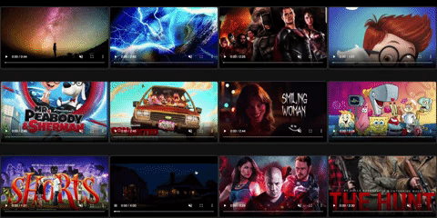
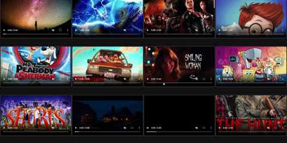

 
# README

# NasFlix
## [Take a look at NasFlix Live](https://nasflix.herokuapp.com)
## Content
* Introduction.
* Technologies.
* Setup.
* Features

## Introduction

NasFlex is a NetFlix clone, it has a mix of movies and TV shows trilers.

## Technologies

* Ruby on rails.
* Postgresql.
* React / Redux.
* AWS S3.
* Deployed on [Heroku](https://nasflix.herokuapp.com)

## Setup

### To get the application up and running do the following:

* Clone the project to your local machine.

* Install frontend dependencies using the command:

  * `npm install`

* Install backend dependencies using the command:

  * `bundle install`

* Make sure PostgreSQL is runing and run:

  * `bundle exec rails db:setup`
  
## features

* User can use a dropdown minue to filter movies and TV shows by Genre
  

* User can hover over each thumbnail to get a preview of the movie

* User can click on a video to show more information and click again to hide that information.

